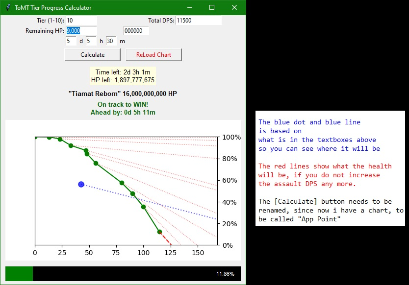

WORK IN PROGRESS.

(Known issue, the blue dot tracker no longer auto-updates it's location)

This is possibly still inaccurate and may have issues.

All data must be manually entered. It does not detect anything from the game.

(below is a synthetic data example. this image is outdated, changes have already been made again)

----------------------

2026-07-29 update: v7.3
Known bug: says I am on the "best" when i am near the middle at the end. I think it is due to having runs that didn't have time logged at the last second. I'll work on coding it to extend the lines of incomplete runs.

I fixed a lag issue that happened at the 1 second mark every second.
I added checkboxes for auto-update for HP remaining and Time remaining.
Added translucent yellow mark on crosshairs to always let you know where you are easier.
I disabled the blue-tracker by default, but a checkbox to re-enable it.
I did that because updating the HP/Time boxes would trigger and always on blue-tracker.
Moved the Rating to below the gradient instead of on top of it, because that is more logical.
Added orange bar of how much HP is left on the progress bar along with percentage to match the projection.

----------------------

2026-07-26 update: v7.2 (fixed mistake of not letting you start new runs. Added "new run" button and saves 1 week files, instead of daily files.)

----------------------

2026-07-22 update: v 7.1 (added indicator of best/worst of runs, not shown in screenshot)

----------------------

2026-07-22 update v 7d-24:

----------------------

Old version (shows the blue indicator, not shown in the example screenshot above, but it's still there):

