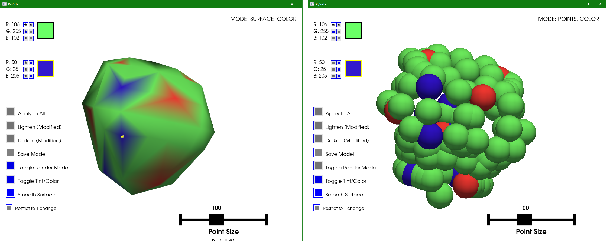

This is a work in progress.
No guarantees for anything.
Newer versions might fix something or add a feature, while possibly breaking previous functions.
This is why i am uploaded all of them.
That way if something used to work and is broken in the newer version, the code can be referenced to fix the newer one, hopefully.

After you extract the files from the LGP, This will let you load the vertex colored model and change colors and save it so that you can add it back to the LGP and load it in the game.

If you are unfamiliar, this is NOT for textures.
Vertexes are for assigning colors to points which translates to the blurred color transitions you see on character models.
If you look at the character models (like Cloud and Tifa), you will see their eyes and lips are detailed, because those are textures, however the rest of their body is just made of solid colors.
The solid color body is what this app i made can modify.

Lets say you want Tifa to have a blue shirt, you can do this.
Lets say you want Cloud to have red pants, you can do this.

Lets say you want Tifa to have a logo on her shirt, you can NOT do this with this tool, since that would require a texture file and I have no idea if that is possible and is beyond the scope of this project.

To view and load/extract/replace and recompile back into LGP.
https://maciej-trebacz.github.io/ff7-lgp-explorer/

(you can also use a command prompt program that will extract all at once into a folder.)

There is a program called Kimera, aka: Kimera095c, Kimera097b, etc.
However, I couldn't get it to load any of the model files.
It always gave errors.
So I coded my own.
This took a TON of trial and error and a ton of AI giving me broken code over and over...

Here are sources I gave it that helped, but isn't enough on it's own to make it code correctly.

===========================================================================================================

Sources i gave to AI to help code this, also feel free to use my project files to help make your own BETTER version or integrate functions to make your app do more:

https://github.com/maciej-trebacz/ff7-lgp-explorer/tree/main/src

https://raw.githubusercontent.com/maciej-trebacz/ff7-lgp-explorer/refs/heads/main/src/rsdfile.ts

https://raw.githubusercontent.com/maciej-trebacz/ff7-lgp-explorer/refs/heads/main/src/texfile.ts

https://raw.githubusercontent.com/maciej-trebacz/ff7-lgp-explorer/refs/heads/main/src/utils/fileService.ts

https://raw.githubusercontent.com/maciej-trebacz/ff7-lgp-explorer/refs/heads/main/src/utils/pfileRenderer.js

https://raw.githubusercontent.com/maciej-trebacz/ff7-lgp-explorer/refs/heads/main/src/utils/settings.ts

https://wiki.ffrtt.ru/index.php/FF7/P

https://namelivia.com/final-fantasy-7-character-modelling-research/

https://maciej-trebacz.github.io/ff7-lgp-explorer/
